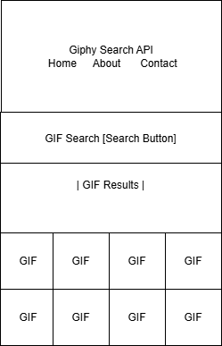
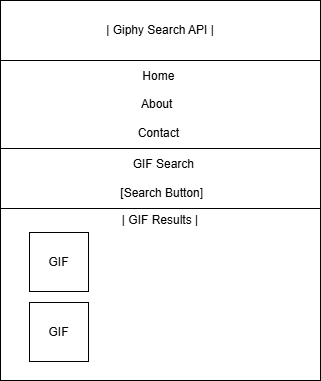

# Giphy Search Engine
A web app that allows users to search for GIFs using the Giphy API.

## Features
- Search for GIFs by keyword
- Display results in a responsive grid
- Responsive design for desktop and mobile

## Technologies Used
- HTML, CSS (SASS), JavaScript
- Giphy API

## Future Improvements
1. Add a loading spinner.
2. Allow users to set the number of GIFs displayed.
3. Add error handling for network issues.

## How to Use
1. Enter a keyword in the search bar to find GIFs.
2. Press the "Search" button to view GIFs related to the keyword in a grid format.
3. Enjoy viewing the results, which are displayed in a responsive grid.

## Screenshots



## Live Demo
View the live site [here](https://anelsonf5c.github.io/giphy-search-engine/
).


## Installation
1. Clone the repository:
   ```bash
   git clone https://github.com/anelsonf5c/giphy-search-engine.git
